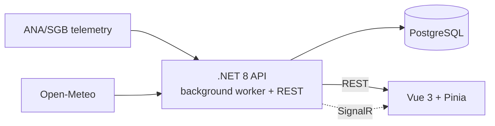

# Cota

**Real-time flood monitoring and alert platform for Porto Alegre, Brazil.**

Cota watches the Guaíba river level and tells residents what it actually means for them: is my region at risk, how much time is there, and where do I go. The name comes from *cota de inundação* — the flood threshold the whole city learned to watch during the May 2024 flood, when the river peaked at 5.35 m.

> 🚧 **Work in progress.** The backend pipeline and the frontend data layer are running; the visual gauge, map and real-time alerts are in development. See the [roadmap](#roadmap).

## The problem

Porto Alegre's riverside and island communities are the first and hardest hit when the Guaíba rises. The data to warn them already exists — ANA/SGB telemetry stations, INMET bulletins, rain forecasts — but it is scattered across government portals, published as raw hydrological readings, and never pushed to the people who need it.

Cota turns that data into a single answer a resident can read in five seconds, and delivers alerts only to the regions each user subscribed to.

## Features

| Status | Feature |
|:---:|---|
| ✅ | River level ingestion on a schedule, with computed risk status (Normal / Atenção / Alerta / Inundação) |
| ✅ | 7-day rain forecast for Porto Alegre |
| 🚧 | Visual level gauge with the 2024 record as reference |
| 🚧 | Level history chart |
| ⬜ | Interactive map: risk zones, shelters and donation points |
| ⬜ | Accounts and per-region subscriptions |
| ⬜ | Real-time push alerts on status change (SignalR groups) |

## Architecture



The API uses two deliberately different integration patterns:

- **River level — push.** A `BackgroundService` polls the telemetry source on a schedule and keeps the latest reading warm, so no user request ever waits on an external API. This is also what makes proactive alerting possible: the system watches the river whether anyone is looking or not.
- **Rain forecast — pull with cache.** Fetched on demand and cached (cache-aside, 30 min TTL), since forecasts change slowly and nothing needs to react to them.

The backend follows a layered, dependency-inverted design:

```
Cota.Domain          entities, risk rules, interfaces — no external dependencies
Cota.Infrastructure  telemetry and weather clients, persistence
Cota.Api             controllers, background workers, composition root
```

Data sources are hidden behind domain interfaces, so swapping the simulated telemetry client for the real ANA one is a single line in `Program.cs`.

## Tech stack

**Backend:** .NET 8, ASP.NET Core, EF Core, PostgreSQL, SignalR
**Frontend:** Vue 3 (Composition API), TypeScript, Pinia, Vite, Tailwind CSS v4, shadcn-vue
**Infra:** Vercel (web), Railway (API + database)

## Getting started

**Prerequisites:** .NET 8 SDK, Node.js LTS.

```bash
git clone https://github.com/matheusbtguerra/cota.git
cd cota
```

**Backend** — runs on `http://localhost:5123`, Swagger UI at `/swagger`:

```bash
cd backend
dotnet run --project Cota.Api
```

**Frontend** — runs on `http://localhost:5173`:

```bash
cd frontend
npm install
npm run dev
```

No API keys are needed to run locally: the weather client uses Open-Meteo (open, keyless) and river readings come from a simulated telemetry client until ANA credentials are wired in.

### Endpoints

| Method | Route | Description |
|---|---|---|
| GET | `/api/river/current` | Latest reading: level, status, station, timestamp |
| GET | `/api/weather/forecast` | 7-day rain forecast and accumulated total |

## Project structure

```
cota/
├── backend/
│   ├── Cota.Api/             controllers, workers, DI composition
│   ├── Cota.Domain/          entities, risk thresholds, interfaces
│   └── Cota.Infrastructure/  external clients
├── docs/
│   ├── SCOPE.md              problem, users, MVP scope, risks
│   └── DESIGN.md             palette, typography, screen specs
└── frontend/
    └── src/
        ├── services/         HTTP layer (axios)
        ├── stores/           Pinia stores
        └── composables/      lifecycle and orchestration
```

## Roadmap

- [x] **Phase 0** — Project scope, design system, scaffolding
- [x] **Phase 1** — Ingestion pipeline, risk rules, REST endpoints *(pending real ANA credentials)*
- [ ] **Phase 2** — Dashboard: level gauge, trend, history chart
- [ ] **Phase 3** — Rain forecast on the dashboard
- [ ] **Phase 4** — Risk zone map with shelters and donation points
- [ ] **Phase 5** — Authentication and region subscriptions
- [ ] **Phase 6** — Real-time alerts via SignalR groups
- [ ] **Phase 7** — Deployment

## Data sources

- **ANA / SGB (HidroWebService)** — telemetric river level readings
- **Open-Meteo** — precipitation forecast
- **INMET** — official weather alerts *(planned)*
- **SGB / City of Porto Alegre** — risk zone mapping and shelters *(planned)*

## Disclaimer

Cota is an independent, non-official project. It complements but does not replace official emergency channels. In an emergency in Brazil, call **199** (Defesa Civil).

## License

[MIT](LICENSE)
